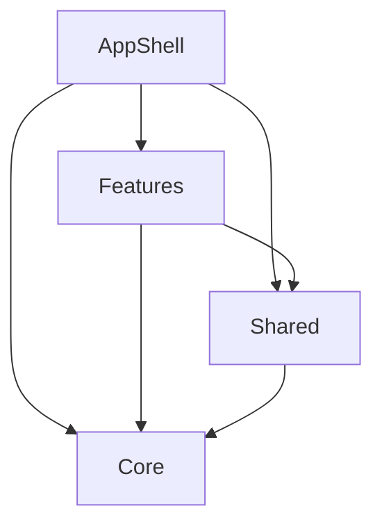

# ModularFeatureSlicedCaseApp Source Map

## Boundaries
- `AppShell/`: composition root, auth gate, app-level dependency wiring, tab coordinator, and root navigation.
- `Features/`: vertical feature slices. Each slice owns its own presentation, navigation, domain contracts, data adapters, DTOs, mappers, repositories, and feature-local stores.
- `Core/`: reusable mechanics shared across features, including design system, local support primitives, networking, persistence, logging, localization, and image loading.
- `Shared/`: narrow reusable presentation helpers and accessibility identifiers.

## Dependency Direction

`Core` must not depend on `Features`, `Shared`, or `AppShell`. `Shared` must not depend on feature slices or app-shell composition.
