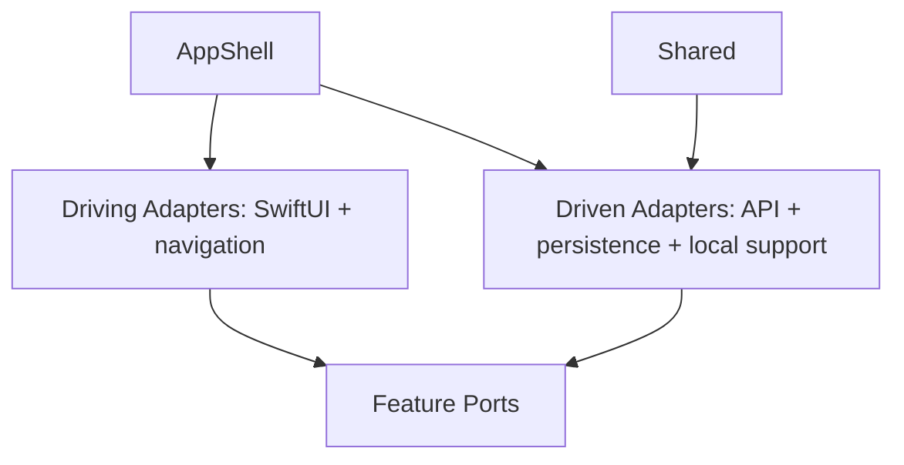

# HexagonalPortsAdaptersCaseApp Source Map

## Boundaries
- `AppShell/`: composition root, auth gate, dependency wiring, tab coordination, and root navigation.
- `Features/<Feature>/Ports/`: domain-owned entities and contracts.
- `Features/<Feature>/Adapters/Driving/`: SwiftUI screens, navigation stacks, and presentation state owners.
- `Features/<Feature>/Adapters/Driven/`: API DTOs, request builders, mappers, concrete repositories, and feature-local stores.
- `Adapters/Driven/CoreInfrastructure/`: cross-feature infrastructure adapters and local support mechanics.
- `Adapters/Driving/DesignSystem/`: reusable UI/design mechanics.
- `Shared/`: narrow presentation helpers and accessibility identifiers.

## Dependency Direction

Ports must not depend on transport, storage, SwiftUI, URLSession, SwiftData, Keychain, or app-shell composition. `AppShell` wires adapters but does not implement adapter internals.

## Port serialization boundary
Port/domain models in this case should not carry persistence or transport serialization requirements by default. Driven adapters own their storage/JSON payloads and map to port models at the boundary; presentation adapters receive user-safe errors and localized strings only after adapter/domain mapping.
