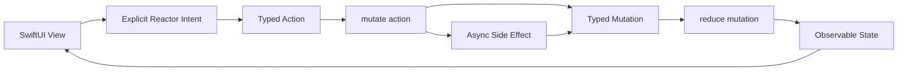
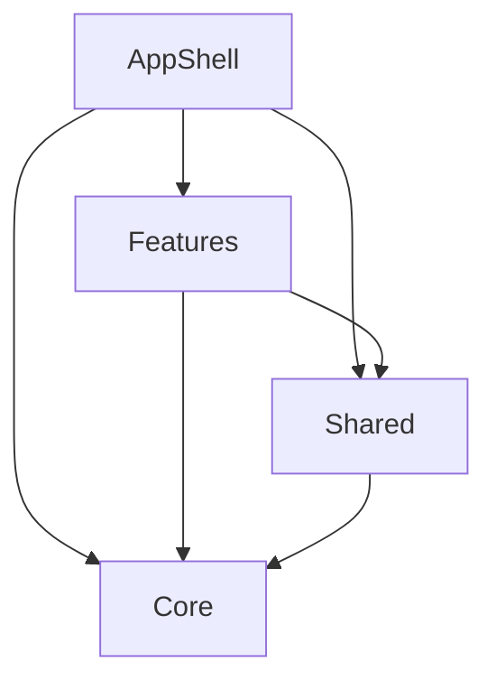

# ReactorStyleCaseApp Source Map

## Boundaries
- `AppShell/`: composition root, auth gate, app-level dependency wiring, tab coordinator, and root navigation.
- `Features/`: feature slices. Presentation state owners are Reactors with explicit `State`, `Action`, `Mutation`, `mutate(_:)`, and `reduce(_:)`.
- `Core/`: reusable mechanics shared across features, including design system, local support primitives, networking, persistence, logging, localization, and image loading.
- `Shared/`: narrow reusable presentation helpers and accessibility identifiers.

## Reactor-Style Flow

## Dependency Direction

Reducers must not perform network or persistence work. `Core` must not depend on `Features`, `Shared`, or `AppShell`. `Shared` must not depend on feature slices or app-shell composition.
