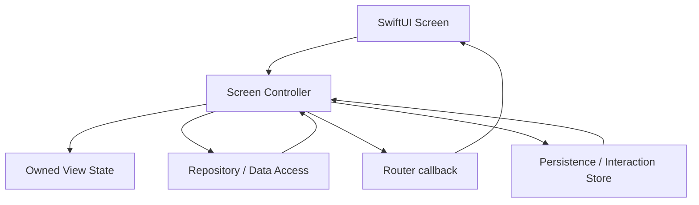

# MVCMigrationCaseApp Structure

- `AppShell/`: app composition, root coordination, tab shell, and dependency construction.
- `Core/`: design system, local infrastructure, networking, persistence, image loading, localization, logging, and error mapping.
- `Features/`: app features. Presentation state owners are screen-scoped `*Controller` types for the MVC migration case.
- `Shared/`: shared SwiftUI presentation helpers and accessibility identifiers.

## MVC Migration Boundary

Controllers intentionally own more screen responsibility than MVVM presenters or Clean/VIP interactors. That is the point of this case: preserve behavior while showing the smallest safe migration boundary from legacy MVC. The controllers must remain screen-scoped; they are not permission to create one massive app controller.
