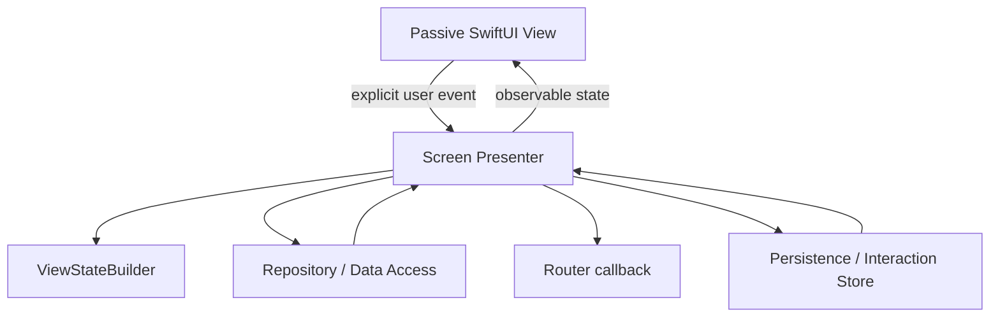

# MVPPassiveViewCaseApp Structure

- `AppShell/`: app composition, root coordination, tab shell, and dependency construction.
- `Core/`: design system, local infrastructure, networking, persistence, image loading, localization, logging, and error mapping.
- `Features/`: app features. Presentation state owners are screen-scoped `*Presenter` types for the MVP Passive View case.
- `Shared/`: shared SwiftUI presentation helpers and accessibility identifiers.

## MVP Passive View Boundary

SwiftUI remains the passive display surface. Presenters own presentation decisions and state transitions; repositories, routers, stores, and builders remain separate so presenters have real presentation responsibility without absorbing data/infrastructure implementation details.
